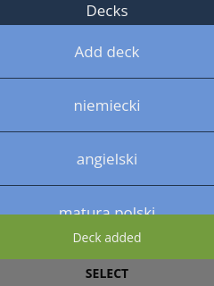
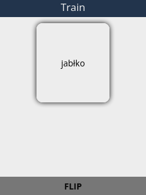
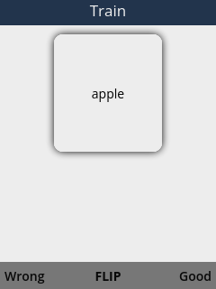

# Flashcards

Flashcards app for KaiOS devices with a simple spaced repetition system. Just like in [Anki](https://apps.ankiweb.net/) you can create your own decks and assign new flashcards to them.





[Flashcards](https://store.bananahackers.net/#flashcards)

## Repetition system

With each good guess the level of a card increments (new cards start with level 0). Next repetition is calculated with a simple formula: `0.2 * level^3`. When your guess is wrong the level gets reseted down to 0.

## Development

### Setup

```
npm install
```

### Compilation

Run `npm run dev` to compile with hot-reloading for development. When you are done with the changes run the `./build.sh` script to compile and build the app. Now you can install the app on your phone with WebIDE:

1. Click on the `Open Packaged App` button
2. Select the `dist/` directory
3. Connect your device via adb
4. Select your device from the right sidebar under `USB DEVICES`
5. Select the app from the left sidebar and click the `Install and run` button

The `flashcards.zip` file is a packaged version installable from [BananaHackers](https://store.bananahackers.net/#flashcards)
